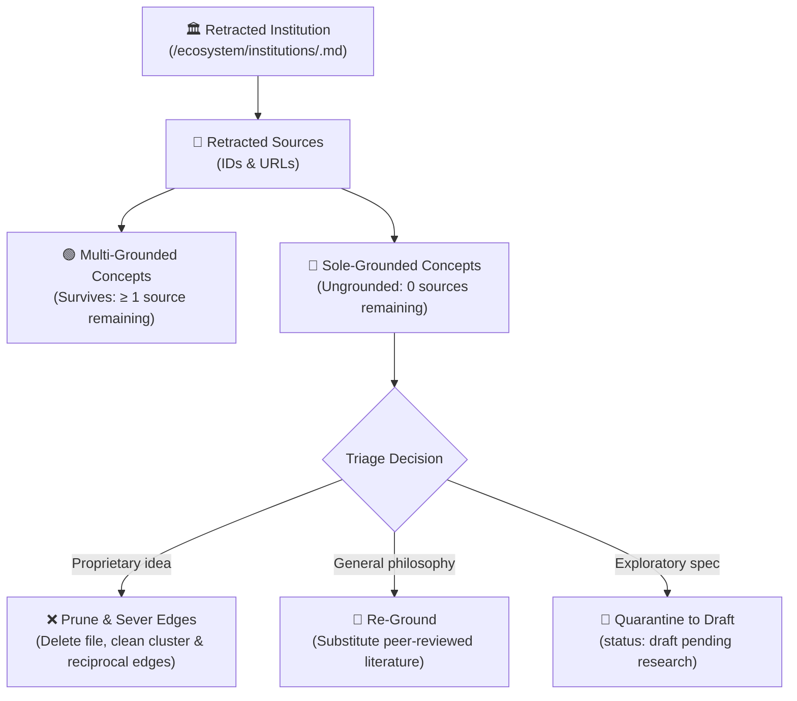

# Backout Institution & Decouple Grounding (Google OKF v0.2)

This skill equips AI agents to safely back out an external research institute, lab, standards body, or moral authority from the knowledge graph. It evaluates downstream concept grounding, identifies sole-grounded concepts whose epistemic validity is compromised, cleans reciprocal edges, and guarantees complete knowledge graph integrity.

---

## 1. When to Use This Skill

Activate this skill whenever the user or engineering team requests to:
* Back out, delete, or retire an institution in `ecosystem/institutions/`.
* Retract or revoke an institution's external sources and citations.
* Audit concept grounding to see which concepts depend on an institution.
* Prune orphaned or ungrounded concepts that lose all evidentiary backing.

### Trigger Phrases:
* `backout institution <name>`
* `remove institution <name> and its sources`
* `retract institution <name>`
* `audit grounding for <name>`
* `/backout-institution <name>`

---

## 2. Epistemic Architecture & Grounding Demarcation

In **Google OKF v0.2**, knowledge is grounded in primary external sources:
$$\text{Institution} \xrightarrow{\text{publishes}} \text{Sources} \xrightarrow{\text{grounds}} \text{Concepts} \xrightarrow{\text{binds into}} \text{Clusters \& Edges}$$

When an institution is retracted:
1. **Multi-Grounded Concepts**: Concepts that cite multiple independent authorities (e.g. Oxford *and* DeepMind, or Council of Europe *and* Vatican).
   * **Action**: Retain concept file; strip retracted source citations from frontmatter.
2. **Sole-Grounded Concepts**: Concepts whose *entire* evidentiary foundation was supplied by the target institution (0 remaining sources).
   * **Action**: Triage via Policy (Prune, Re-ground, or Quarantine to Draft).



---

## 3. Standard Operating Procedures

### Procedure A: Discovery & Dry-Run Impact Audit
Always run a non-destructive dry-run first to inspect the blast radius:

```bash
# 1. List all institutions and their dependency counts:
python3 scripts/backout_institution.py --list

# 2. Run detailed blast-radius audit for a specific institution:
python3 scripts/backout_institution.py --institution <slug>
```

The audit report outputs:
* Institutional metadata and declared source IDs.
* **Multi-Grounded Concepts**: Concepts that survive with remaining sources.
* **Sole-Grounded Concepts**: Concepts that will lose 100% of their sources.
* **Relational Blast Radius**: Affected cluster matrices, reciprocal concept edge tables (`## 6. Relational Edge Index`), Mermaid flowcharts, and inbound markdown links.

---

### Procedure B: Consult with the User on Sole-Grounded Concepts
If sole-grounded concepts are detected:
1. Present the list of ungrounded concepts to the user.
2. Explain why they are ungrounded (0 sources remaining).
3. Confirm the strategy:
   * **Prune** (`--action-ungrounded prune`): Permanently delete the concept and cleanly sever all graph connections.
   * **Draft** (`--action-ungrounded draft`): Quarantine the concept in `status: draft` so it does not fail stable source validation.
   * **Re-ground**: Manually provide alternative sources before running the backout.

---

### Procedure C: Executing the Automated Backout
Run the automated backout script with `--apply`:

```bash
# Example: Prune ungrounded concepts and sever graph edges
python3 scripts/backout_institution.py --institution <slug> --apply --action-ungrounded prune

# Example: Quarantine ungrounded concepts to draft
python3 scripts/backout_institution.py --institution <slug> --apply --action-ungrounded draft
```

The script automatically executes:
1. **Source Stripping**: Cleans frontmatter `sources:` in multi-grounded concepts.
2. **Sole-Grounded Execution**:
   * Deletes pruned concept files.
   * Cleans parent `cluster-*.md` matrices and introductory text.
   * Cleans reciprocal edges in other concept edge tables (`## 6. Relational Edge Index`).
   * Cleans nodes and arrows in Mermaid flowcharts.
   * Replaces dead concept links across `systems/`, `ecosystem/`, and `playbooks/`.
3. **Institution Removal**:
   * Deletes `ecosystem/institutions/<slug>.md`.
   * Removes row from `ecosystem/institutions/overview.md`.
   * Normalizes inbound links across the entire repository.
4. **Audit Logging**: Appends a standardized entry to `log.md`.
5. **Synchronization & Gatekeeper**:
   * Automatically invokes `scripts/update_index.py` to regenerate `index.md`.
   * Runs `scripts/validate.py --fix` to verify 0 errors and 0 warnings.

---

### Procedure D: Final Presubmit Verification
Before concluding any backout task, verify that the zero-defect gate passes:

```bash
python3 scripts/presubmit.py
```

Ensure:
* **0 Errors**: All YAML frontmatter valid; zero broken file links.
* **0 Warnings**: No orphan concepts; all stable concepts have primary sources.

---

## 4. Maintenance Scripts

* **Institutional Backout Decoupler**: [`scripts/backout_institution.py`](file:///scripts/backout_institution.py)
* **Presubmit Gatekeeper**: [`scripts/presubmit.py`](file:///scripts/presubmit.py)
* **Bundle Validator**: [`scripts/validate.py`](file:///scripts/validate.py)
* **Index Generator**: [`scripts/update_index.py`](file:///scripts/update_index.py)
