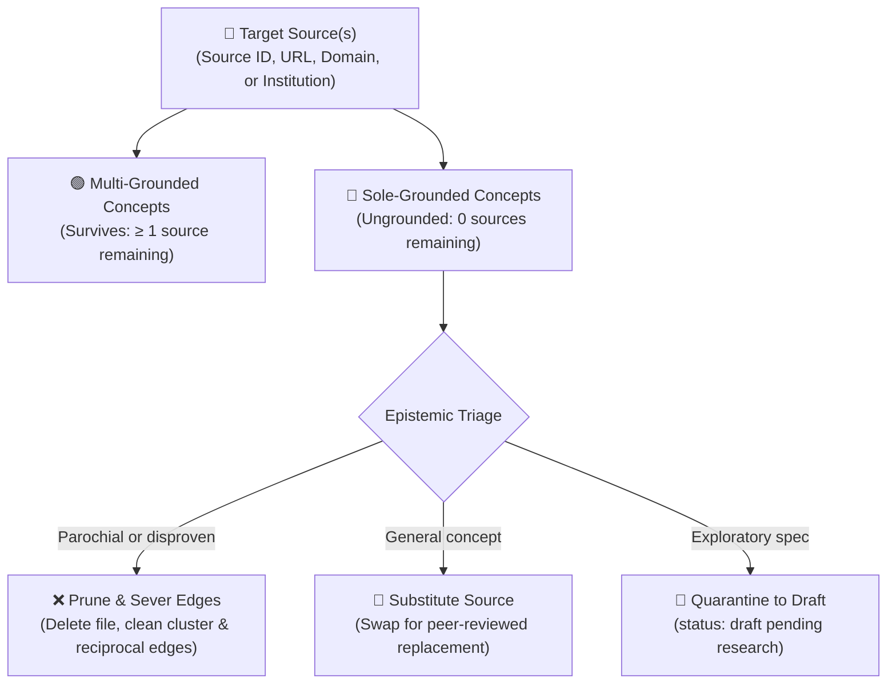

# Universal Source Retraction & Grounding Decoupler (Google OKF v0.2)

This skill equips AI agents to safely retract, decouple, or substitute any external source, academic paper, URL, statutory treaty, or institutional container across the knowledge graph. It evaluates downstream concept grounding, identifies concepts whose epistemic validity is compromised, cleans reciprocal edges, and guarantees complete knowledge graph integrity.

---

## 1. When to Use This Skill

Activate this skill whenever the user or engineering team requests to:
* **Retract a Specific Source**: A research paper, dataset, or URL has been retracted, disproven, or deprecated.
* **Substitute a Source**: Replace an outdated paper or broken URL with an authoritative peer-reviewed replacement across all dependent concepts.
* **Backout an Institution**: Retract all sources published by an external research institute, lab, or moral authority.
* **Retract a Statutory Document**: A legal treaty, standard, or regulation in `/ecosystem/` has been repealed or superseded.
* **Audit Source Grounding**: Inspect which concepts depend on a source, and whether any concepts would lose 100% of their evidentiary grounding.

### Trigger Phrases:
* `backout source <id-or-url>`
* `retract source <name-or-id>`
* `remove source <id-or-url>`
* `replace source <old-id> with <new-id>`
* `backout institution <name>`
* `/backout-source <target>`

---

## 2. Epistemic Architecture & Grounding Demarcation

In **Google OKF v0.2**, knowledge is grounded in primary external sources:
$$\text{Source / Authority} \xrightarrow{\text{grounds}} \text{Concepts} \xrightarrow{\text{binds into}} \text{Clusters \& Relational Edges}$$

When target sources are retracted:
1. **Multi-Grounded Concepts**: Concepts that cite multiple independent authorities (e.g. Oxford *and* DeepMind, or Council of Europe *and* Vatican).
   * **Action**: Retain concept file; strip retracted source citations from frontmatter.
2. **Sole-Grounded Concepts**: Concepts whose *entire* evidentiary foundation was supplied by the retracted sources (0 remaining sources).
   * **Action**: Triage via Policy (Prune, Re-ground / Substitute, or Quarantine to Draft).



---

## 3. Standard Operating Procedures

### Procedure A: Inspecting Available Sources & Dependencies
To inspect all indexed sources and their citation counts across the repository:

```bash
# List all sources sorted by concept citations:
python3 scripts/backout_source.py --list

# List all institutions and their source counts:
python3 scripts/backout_source.py --list-institutions
```

---

### Procedure B: Dry-Run Impact Audit
Always run a non-destructive dry-run first to inspect the blast radius:

```bash
# 1. Target by Source ID:
python3 scripts/backout_source.py --source source:positive-alignment-paper

# 2. Target by Resource URL:
python3 scripts/backout_source.py --url "https://arxiv.org/abs/2605.10310"

# 3. Target by Institution Slug:
python3 scripts/backout_source.py --institution deepmind-institute

# 4. Target by Source Container Document:
python3 scripts/backout_source.py --doc ecosystem/magnifica-humanitas.md

# 5. Target by Web Domain:
python3 scripts/backout_source.py --domain arxiv.org
```

The audit report details:
* Target sources matched.
* Multi-Grounded Concepts surviving with residual sources.
* Sole-Grounded Concepts facing complete epistemic depletion.
* Graph blast radius (clusters, reciprocal edge tables, Mermaid flowcharts, inbound links).

---

### Procedure C: Executing the Backout or Substitution

#### Option 1: Pruning Ungrounded Concepts (Default)
Permanently deletes ungrounded concepts, cleans parent cluster matrices, and severs reciprocal edges in peer concepts:
```bash
python3 scripts/backout_source.py --source <source_id> --apply --action-ungrounded prune
```

#### Option 2: Quarantining Ungrounded Concepts to Draft Status
Preserves the concept file, demotes it to `status: draft`, strips the retracted source, and injects a warning alert:
```bash
python3 scripts/backout_source.py --source <source_id> --apply --action-ungrounded draft
```

#### Option 3: Source Substitution (Seamless Re-grounding)
Replaces the retracted source with a new peer-reviewed source across all dependent concepts, preventing ungroundedness:
```bash
python3 scripts/backout_source.py --source source:old-id \
  --apply \
  --action-ungrounded substitute \
  --substitute-id source:new-id \
  --substitute-url "https://arxiv.org/abs/2610.12345" \
  --substitute-title "New Authoritative Grounding Paper (2026)"
```

#### Option 4: Full Institutional Retraction & Container Deletion
Retracts all institutional sources, deletes the institution profile, and archives all artifacts:
```bash
python3 scripts/backout_source.py --institution <slug> --apply --action-ungrounded prune
```

---

### Procedure D: Reincorporating Archived Sources & Concepts
Whenever an asset was backed out, a complete snapshot is automatically preserved in `archive/<timestamp>_<slug>/` (containing original files, frontmatter diffs, cluster entries, and reciprocal edge mappings).

To inspect and restore backed-out assets back into the active knowledge graph:

```bash
# 1. List all available archive packages:
python3 scripts/reincorporate_source.py --list

# 2. Reincorporate / restore an archive:
python3 scripts/reincorporate_source.py --archive <archive_id_or_slug>
# or
python3 scripts/backout_source.py --restore <archive_id_or_slug>
```

The restoration engine:
1. Restores all backed-out files to their original locations.
2. Re-injects retracted source citations into multi-grounded concepts.
3. Restores parent cluster matrix rows in `concepts/cluster-*.md`.
4. Restores reciprocal edges in peer concept `## 6. Relational Edge Index` tables.
5. Restores institution rows in `ecosystem/institutions/overview.md`.
6. Appends a reincorporation audit entry to `log.md`.
7. Synchronizes `index.md` and validates bundle integrity via `scripts/presubmit.py`.

---

### Procedure E: Final Presubmit Verification
Before concluding any source backout or reincorporation task, verify that the zero-defect gate passes:

```bash
python3 scripts/presubmit.py
```

Ensure:
* **0 Errors**: All YAML frontmatter valid; zero broken file links.
* **0 Warnings**: No orphan concepts; all stable concepts have primary sources.

---

## 4. Maintenance Scripts

* **Universal Source Decoupler**: [`scripts/backout_source.py`](file:///scripts/backout_source.py)
* **Archive Reincorporator**: [`scripts/reincorporate_source.py`](file:///scripts/reincorporate_source.py)
* **Institutional Decoupler Alias**: [`scripts/backout_institution.py`](file:///scripts/backout_institution.py)
* **Presubmit Gatekeeper**: [`scripts/presubmit.py`](file:///scripts/presubmit.py)
* **Bundle Validator**: [`scripts/validate.py`](file:///scripts/validate.py)
* **Index Generator**: [`scripts/update_index.py`](file:///scripts/update_index.py)
