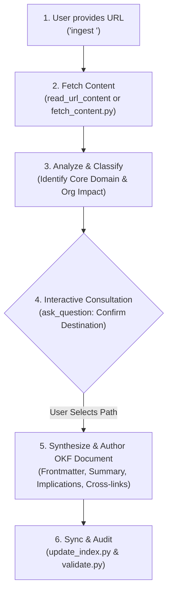

# Ingest URL Content into the Knowledge Base

This skill enables any agent to download content from an external URL, thoughtfully analyze its relevance to the organization's systems and strategy, interactively ask the user where in the knowledge base it should be placed, and synthesize it into a clean, well-structured **Google Open Knowledge Format (OKF v0.2)** document.

---

## 1. Trigger Phrases & Invocation

Activate this skill whenever the user says:
- `ingest <url>`
- `ingest https://...`
- `ingest this article: <url>`
- `add <url> to the knowledge base / wiki`
- `import documentation from <url>`

---

## 2. The 5-Step Ingest Workflow



---

### Step 1: Fetch and Extract the URL Content
1. Use `read_url_content` with the provided URL to retrieve clean markdown text.
2. If `read_url_content` is unavailable or returns an error, run the helper script:
   ```bash
   python3 skills/ingest/scripts/fetch_content.py "<URL>"
   ```
3. Extract metadata:
   - **Document Title**: Official title from `<title>` or primary `h1`.
   - **Source Organization / Publisher**: Authoritative agency, corporation, or standards body.
   - **Publication Date**: If available.
   - **Core Themes**: Regulation, API changes, competitor benchmarks, user research, architecture standards.

---

### Step 2: Thoughtful Semantic Classification
Evaluate the content against the knowledge base taxonomy:

| Destination Category | Scope & Criteria | Typical Document Types |
| :--- | :--- | :--- |
| **`ecosystem/`** | **"What Is" (External Reality)**: External laws, statutory regulations, partner platforms, payment rails, industry standards. | Government policies, partner API releases, compliance regulations. |
| **`systems/`** | **"What Is" (Internal Reality)**: Active production architecture, codebases, data models, or service documentation. | Service specs, API endpoints, schema definitions, internal workflows. |
| **`concepts/`** | **"What Could Be" (Innovation)**: Proposed features, architectural RFCs, exploratory prototypes. | Product RFCs, new feature proposals, feasibility studies. |
| **`playbooks/`** | **Operational SOPs**: Step-by-step human or agent runbooks. | Setup checklists, incident playbooks, deployment runbooks. |
| **`research/`** | **Field Research**: Qualitative research, user interviews, surveys. | Transcripts, user observation notes, customer feedback. |
| **`references/`** | **Specifications & Standards**: Foundational reference specifications. | Data dictionaries, protocol standards, format guidelines. |

---

### Step 3: Mandatory User Confirmation via `ask_question`
**DO NOT write the file before asking the user!**
Formulate an interactive multiple-choice question using `ask_question`:

* **Question**: `"Where in the knowledge base would you like to place this content?"`
* **Options**:
  - Always list your **recommended placement first** prefixed with `(Recommended)` and a brief rationale.
  - Provide 2–3 plausible alternative categories.
  - Format options as clear paths with short explanations.

*Example `ask_question` Call*:
```json
{
  "questions": [
    {
      "question": "I analyzed the external specification. Where should this be placed in the knowledge base?",
      "is_multi_select": false,
      "options": [
        "(Recommended) ecosystem/new-payment-api-standard.md (External partner API standard under 'What Is')",
        "concepts/payment-gateway-upgrade.md (Product RFC proposal for upgrading internal payments)",
        "playbooks/payment-integration-runbook.md (Operational runbook for integrating the API)"
      ]
    }
  ],
  "toolSummary": "Confirming knowledge base destination",
  "toolAction": "Asking user for content placement"
}
```

---

### Step 4: Synthesize the OKF v0.2 Document
Never do a raw copy-paste dump of the webpage text. Thoughtfully synthesize the content into an executive-grade OKF document:

1. **Strict YAML Frontmatter**:
   ```yaml
   ---
   type: <Ecosystem Context | Technical Specification | Concept | Playbook | Research Notes>
   title: "Accurate Descriptive Title"
   description: "Single-sentence executive summary of the content and its importance."
   tags: [tag1, tag2, tag3]
   status: stable  # Use 'draft' if exploratory concept
   generated:
     by: agent:ingest
     at: <ISO 8601 UTC timestamp>
   verified: []
   sources:
     - id: source:<slug>
       resource: <ORIGINAL_URL>
       title: "<Publication Name / Article Title>"
   ---
   ```

2. **Standard Document Sections**:
   - `# [Title]`
   - `## 1. Executive Summary`: Concise 2–3 paragraph synthesis of the source.
   - `## 2. Core Policies, Directives & Data`: Key findings, statutory articles, technical parameters, or operational tables extracted from the source.
   - `## 3. Strategic Implications for the Organization`: Explicit breakdown of how this affects our systems, team operations, or product roadmap.
   - `## 4. Key Reference Points & Excerpts`: High-signal quotes or data tables from the original text.
   - `## 5. Related Knowledge Base Documents`: Bundle-relative links to related documents in the knowledge base.

---

### Step 5: Synchronize Index, Log, and Validate
Once the document is saved:
1. **Regenerate Index**:
   ```bash
   python3 scripts/update_index.py
   ```
2. **Append to `log.md`**:
   Add an entry under the current date:
   ```markdown
   * **Ingestion**: Ingested [<Title>](/<relative-path>) from [<Source Title>](<URL>) covering [topic].
   ```
3. **Run Presubmit Gatekeeper**:
   ```bash
   python3 scripts/presubmit.py
   ```
