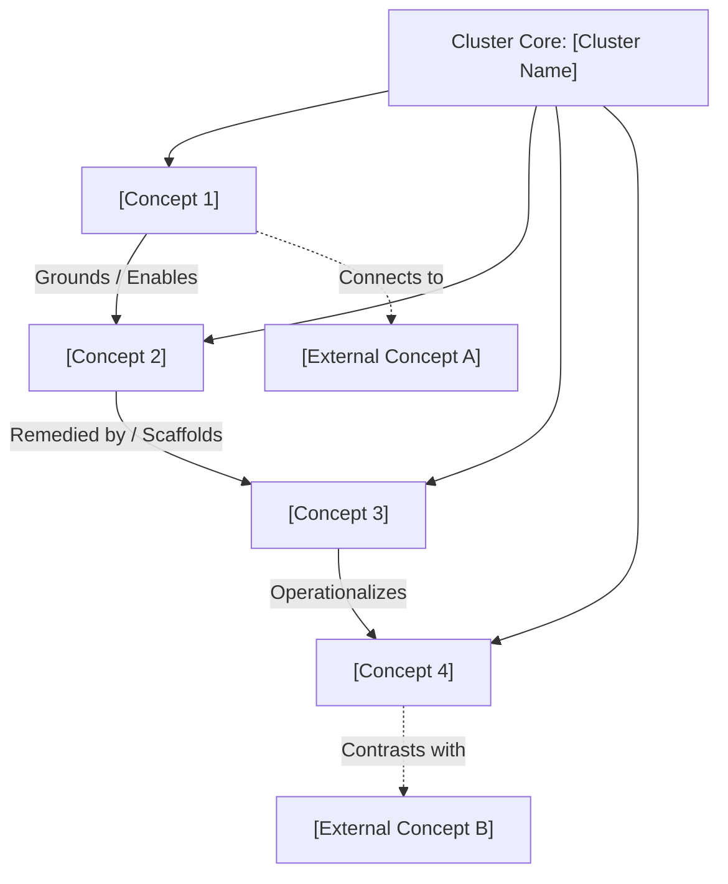

# Concept Cluster: [Cluster Name]

---

## 1. Executive Summary & Cluster Thesis

A comprehensive 2–3 paragraph overview defining the core thematic tension, organizing question, or architectural paradigm that unites this cluster of concepts.

* **Organizing Tension**: Contrast the primary competing paradigms (e.g. centralized orchestration vs. distributed autonomy, automated velocity vs. human verification).
* **Scope of Inquiry**: Define what lies within this cluster's boundary and how it relates to core organizational values and system architecture.
* **Strategic Relevancy**: Explain why this cluster is critical for software engineering, product strategy, and institutional governance.

---

## 2. Cluster Concept Mind Map & Relational Edges

Visualize how the constituent concepts in this cluster relate to one another and connect outward to adjacent clusters:

---

## 3. Constituent Concepts Matrix

Detail all concepts belonging directly to this cluster:

| Concept Document | Core Thesis & Definition | Primary Normative / Technical Anchor | Lifecycle Status |
| :--- | :--- | :--- | :--- |
| **[Concept Node 1](/concepts/future-initiative.md)** | Brief 1-2 sentence description of the concept's core thesis. | *e.g., Core Architecture, Industry Standard RFC* | `draft` |
| **[Concept Node 2](/concepts/future-initiative.md)** | Brief 1-2 sentence description of the concept's core thesis. | *e.g., Sociotechnical Alignment, Safety Standard* | `draft` |

---

## 4. Cross-Cluster Relational Dynamics (Edge Map)

Analyze how this cluster interacts with neighboring conceptual domains:

| Source Node in Cluster | Relationship Type | Target Concept / Cluster | Detailed Description of Edge |
| :--- | :--- | :--- | :--- |
| **[Concept Node 1](/concepts/future-initiative.md)** | *Grounds* | [System Architecture](/systems/core-architecture.md) | How this concept establishes or depends upon foundational system capabilities. |
| **[Concept Node 2](/concepts/future-initiative.md)** | *Operationalized as* | [Production Workflow](/playbooks/knowledge-driven-engineering.md) | How theoretical principles are translated into day-to-day engineering workflows. |

---

## 5. Institutional & Theoretical Grounding

Map the intellectual provenance of this cluster across external institutions, standards bodies, and canonical literature:

* **Academic & Industry Research Centers**:
  * **Research Center A** — Key methodologies, foundational datasets, or theoretical proofs.
  * **Standards Body B** — Specifications, protocol definitions, or interoperability criteria.
* **Regulatory & Statutory Authorities**:
  * **Statutory Body C** — Statutory compliance mandates, privacy requirements, or certification frameworks.

---

## 6. Applied Operational & Engineering Implications

What this cluster requires of technical architects, product managers, and engineering teams:

1. **System Architecture Guardrails**: Concrete software constraints (e.g. non-delegable human veto, transparent scratchpads, cryptographic audit logs).
2. **Operational Practices**: Standard operating procedures, review ceremonies, or automated verification pipelines.
3. **Institutional Governance**: Audit protocols, procurement red lines, and compliance checkpoints.

---

## 7. Related Knowledge Base Documents & Primary Literature

### Internal Knowledge Base Links
* [System Architecture Specification](/systems/core-architecture.md) — Active production infrastructure and service contracts.
* [External Industry Landscape](/ecosystem/industry-landscape.md) — External regulatory and standards environment.
* [Knowledge-Driven Engineering Playbook](/playbooks/knowledge-driven-engineering.md) — Integrating concepts into SDD development sprints.

### External Primary Sources
* [Author et al. (2026), *Title of Foundational Paper*](https://example.org/paper)
* [Standards Organization (2025), *Industry Technical Specification*](https://example.org/spec)
