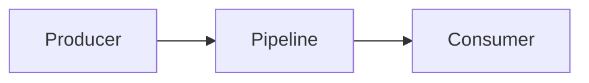

# Concept Title

## Overview
High-level summary of the concept and its intended impact.

---

## Architectural Design
Describe the components, contracts, and interactions.

---

## Technical Specifications
Interface details and schema tables.

---

## Related Documents
* [The DELTA Framework](/ecosystem/delta-framework.md)
