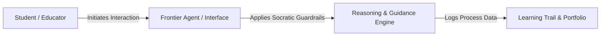

# Frontier Idea Title

## 1. Executive Summary & Core Hypothesis
A concise, high-level summary of the nascent idea, exploratory prototype, or horizon-scanning initiative.
* **Core Hypothesis**: What fundamental assumption is being tested?
* **Intended Value**: How does this emerging capability empower students, faculty, or the institution?

---

## 2. Horizon Context & Enabling Shifts
Explain why this idea is emerging *now*. 
* **Technological Catalysts**: What underlying models, agentic workflows, edge capabilities, or modalities enable this?
* **Pedagogical / Operational Context**: What gap in existing practice or curriculum does this address?
* **External Reference Points**: Are there frontier labs or peer institutions experimenting in adjacent spaces?

---

## 3. Conceptual Architecture & User Flow
Describe the exploratory workflow, agentic interaction, or prototype mechanics.

### Key Workflow Components
1. **Trigger & Interface**: How the user encounters or invokes the system.
2. **Autonomous / Intelligent Behavior**: What the model or system does, and what decisions remain strictly in human hands.
3. **Data & State Contracts**: Intermediate state, telemetry, or reflection artifacts captured.

---

## 4. Ethical Stress-Testing & Virtue Alignment
Every emerging idea must be vetted against our moral and pedagogical anchors:

| Evaluative Dimension | Framework Reference | Analysis & Mitigations |
| :--- | :--- | :--- |
| **Human Dignity & Agency** | DELTA Agency / *Magnifica Humanitas* | Does this preserve human sovereignty, or does it encourage cognitive deskilling? |
| **Productive Struggle** | MIT & Harvard Pedagogy | Does this retain the cognitive friction necessary for deep learning? |
| **Incarnational Presence** | DELTA Embodiment | Does this enhance in-person communal relationships or risk synthetic intimacy? |
| **Epistemic Integrity** | DELTA Transcendence | How are hallucinations, ungrounded outputs, or deceptive fluency mitigated? |

---

## 5. Experimentation Plan, Metrics & Kill Criteria
Define a lightweight, low-risk protocol to test the idea before broad deployment.

* **Phase 1 Pilot**: Scope (single cohort, mock trial, sandboxed lab).
* **Validation Metrics**: How will we know if the hypothesis holds true? (e.g., student metacognition, educator time saved, agency preservation).
* **Kill Criteria**: Specific negative indicators (e.g., homework shortcutting, loss of critical engagement, technical brittleness) that would cause us to abandon or fundamentally pivot this idea.
