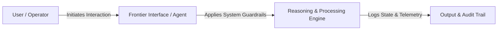

# Frontier Idea Title

## 1. Executive Summary & Core Hypothesis
A concise, high-level summary of the nascent idea, exploratory prototype, or horizon-scanning initiative.
* **Core Hypothesis**: What fundamental assumption or emerging opportunity is being tested?
* **Intended Value**: How does this emerging capability empower users, customers, or the organization?

---

## 2. Horizon Context & Enabling Shifts
Explain why this idea is emerging *now*. 
* **Technological Catalysts**: What underlying models, agentic workflows, edge capabilities, or modalities enable this?
* **Operational & Market Context**: What gap in existing practice, user workflows, or market offerings does this address?
* **External Reference Points**: Are there frontier research labs, startups, or standards bodies experimenting in adjacent spaces?

---

## 3. Conceptual Architecture & User Flow
Describe the exploratory workflow, agentic interaction, or prototype mechanics.

### Key Workflow Components
1. **Trigger & Interface**: How the user encounters, invokes, or monitors the system.
2. **Autonomous / Intelligent Behavior**: What the model or automated system does, and what decisions remain strictly in human hands.
3. **Data & State Contracts**: Intermediate state, telemetry, feedback loops, or evaluation artifacts captured.

---

## 4. Evaluative Stress-Testing & Architectural Alignment
Every emerging idea must be vetted against our organizational principles and architectural invariants:

| Evaluative Dimension | Framework Reference | Analysis & Mitigations |
| :--- | :--- | :--- |
| **Human Agency & Oversight** | Core Principles | Does this preserve user sovereignty and meaningful human control? |
| **System Reliability & Safety** | Technical Standards | How are hallucinations, cascading errors, or ungrounded outputs mitigated? |
| **Data Privacy & Governance** | Regulatory Compliance | Does this comply with data sovereignty, encryption, and zero-leakage requirements? |
| **Operational Feasibility** | Systems Reality | What infrastructure, latency budget, or compute resources does this require? |

---

## 5. Experimentation Plan, Metrics & Kill Criteria
Define a lightweight, low-risk protocol to test the idea before broad deployment.

* **Phase 1 Pilot**: Scope (sandboxed prototype, small user cohort, synthetic benchmark).
* **Validation Metrics**: How will we know if the hypothesis holds true? (e.g., task completion rate, latency reduction, user satisfaction).
* **Kill Criteria**: Specific negative indicators (e.g., high error rate, excessive latency, loss of human engagement, brittle edge cases) that would cause us to abandon or fundamentally pivot this idea.
