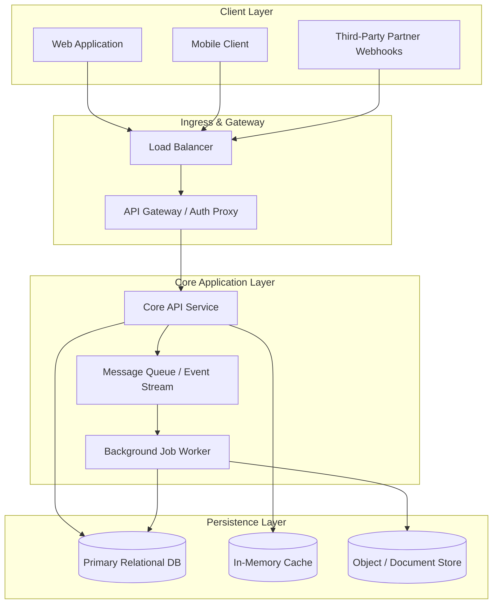

# Core System Architecture Overview

## 1. Executive Summary
This document provides the canonical overview of our active production services, network topology, and persistent storage layers. It represents current operational ground truth ("What Is").

---

## 2. Architecture Diagram

---

## 3. Production Service Inventory

| Service | Primary Stack | Responsibility | Datastores |
| :--- | :--- | :--- | :--- |
| **API Gateway** | Envoy / Go | Authentication, rate limiting, request routing | Redis |
| **Core API** | Python / Node / Go | Domain business logic, REST & GraphQL endpoints | PostgreSQL |
| **Worker Engine** | Python / Go | Asynchronous background jobs, webhook retries | PostgreSQL, Redis |
| **Event Stream** | Kafka / RabbitMQ | Event broadcasting and decoupled pub/sub | Local storage |

---

## 4. Key Architectural Invariants
1. **Stateless Service Nodes**: All web and API application containers are strictly stateless.
2. **Idempotency**: All mutating operations (`POST`, `PUT`, `DELETE`) require unique request tokens to prevent duplicate side effects.
3. **Data Protection**: Sensitive customer fields are encrypted at rest and in transit.

---

## 5. Related Knowledge Base Documents
* [Industry Landscape & External Rails](/ecosystem/industry-landscape.md) - Third-party dependencies and regulatory environment.
* [Future Initiative Concept](/concepts/future-initiative.md) - Architectural proposals for next-generation features.
* [Developer Onboarding Playbook](/playbooks/onboarding-guide.md) - Local development setup and testing guide.
