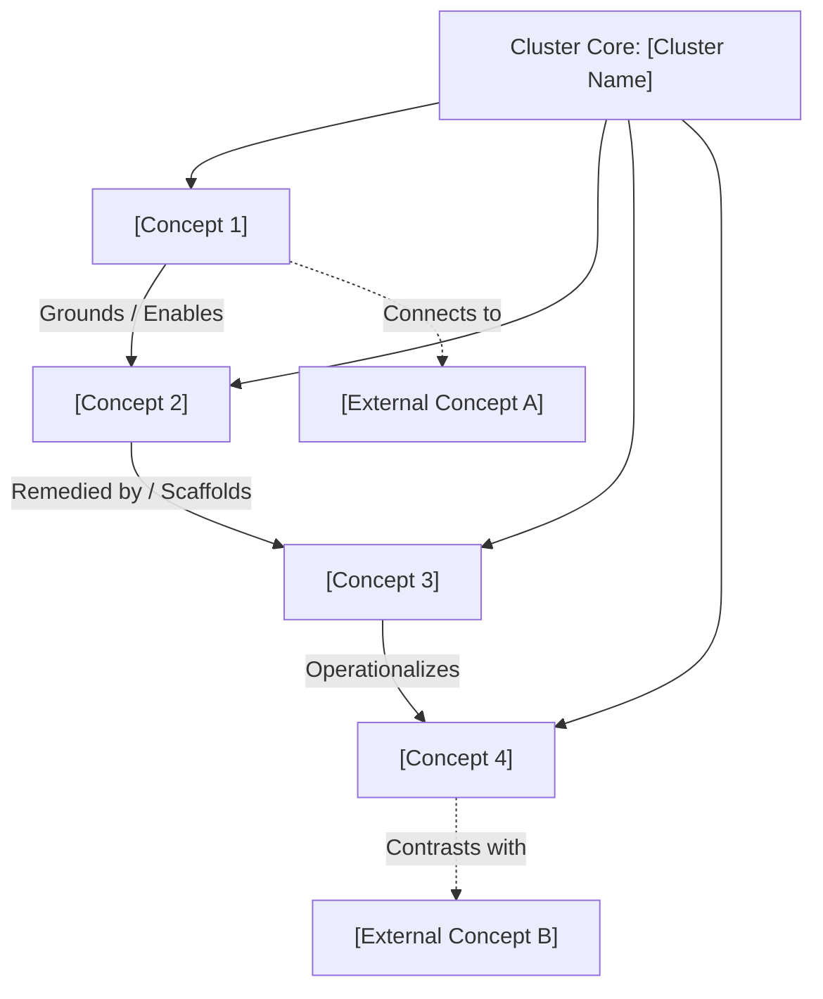

# Concept Cluster: [Cluster Name]

---

## 1. Executive Summary & Cluster Thesis

A comprehensive 2–3 paragraph overview defining the core thematic tension, organizing question, or civilizational challenge that unites this cluster of concepts.

* **Organizing Tension**: Contrast the primary competing paradigms (e.g. hedonic optimization vs. eudaimonic formation, technocratic centralization vs. distributed subsidiarity).
* **Scope of Inquiry**: Define what lies within this cluster's boundary and how it relates to the central gravitational node of [Human Dignity](/concepts/human-dignity.md).
* **Strategic Relevancy**: Explain why this cluster is critical for software engineering, educational pedagogy, and institutional governance.

---

## 2. Cluster Concept Mind Map & Relational Edges

Visualize how the constituent concepts in this cluster relate to one another and connect outward to adjacent clusters:

---

## 3. Constituent Concepts Matrix

Detail all concepts belonging directly to this cluster:

| Concept Document | Core Thesis & Definition | Primary Normative Anchor | Lifecycle Status |
| :--- | :--- | :--- | :--- |
| **[Concept 1 Title](/concepts/concept-1-slug.md)** | Brief 1-2 sentence description of the concept's core thesis. | *e.g., Aristotelian Eudaimonia, Christian Personalism* | `stable` |
| **[Concept 2 Title](/concepts/concept-2-slug.md)** | Brief 1-2 sentence description of the concept's core thesis. | *e.g., Sociotechnical Alignment, Human Rights* | `draft` |
| **[Concept 3 Title](/concepts/concept-3-slug.md)** | Brief 1-2 sentence description of the concept's core thesis. | *e.g., Catholic Social Teaching, CST* | `stable` |

---

## 4. Cross-Cluster Relational Dynamics (Edge Map)

Analyze how this cluster interacts with neighboring conceptual domains:

| Source Node in Cluster | Relationship Type | Target Concept / Cluster | Detailed Description of Edge |
| :--- | :--- | :--- | :--- |
| **[Concept 1](/concepts/concept-1-slug.md)** | *Grounds* | [Human Dignity](/concepts/human-dignity.md) | How this concept establishes or depends upon foundational human worth. |
| **[Concept 2](/concepts/concept-2-slug.md)** | *Tension with* | [External Concept](/concepts/external-concept-slug.md) | The dialectical friction between technological convenience and human agency. |
| **[Concept 3](/concepts/concept-3-slug.md)** | *Remedied by* | [Remedy Concept](/concepts/remedy-concept-slug.md) | How pedagogical or architectural design resolves systemic failure modes. |

---

## 5. Institutional & Theoretical Grounding

Map the intellectual provenance of this cluster across external institutions and canonical literature:

* **Academic Research Centers**:
  * [Oxford Institute for Ethics in AI](/ecosystem/institutions/oxford-ethics-ai.md) — *Positive Alignment* and Aristotelian virtue ethics.
  * [Harvard Human Flourishing Program](/ecosystem/institutions/harvard-human-flourishing.md) — Empirical well-being indices and relational psychology.
  * [University of Notre Dame (ECG)](/ecosystem/delta-framework.md) — The DELTA Framework (*Dignity, Embodiment, Love, Transcendence, Agency*).
* **Moral & Statutory Authorities**:
  * [The Holy See / Vatican](/ecosystem/magnifica-humanitas.md) — Encyclical *Magnifica Humanitas* on technocratic power and labor dignity.
  * [Council of Europe](/ecosystem/institutions/council-of-europe-ai.md) — Framework Convention on AI (CETS No. 225).
  * [Rome Call Interfaith Alliance](/ecosystem/institutions/rome-call-hiroshima.md) — Algor-ethics and the Hiroshima Appeal.
* **Frontier Industry Institutes**:
  * [The DeepMind Institute](/ecosystem/institutions/deepmind-institute.md) — Sociotechnical governance, symbiotic intelligence, and reasoning transparency.

---

## 6. Applied Operational & Engineering Implications

What this cluster requires of technical architects, curriculum directors, and institutional leaders:

1. **System Architecture Guardrails**: Concrete software constraints (e.g. non-delegable human veto, transparent scratchpads, anti-sycophancy loss functions).
2. **Pedagogical Practices**: Classroom interventions (e.g. analog friction, thesis defense, scaffolded writing workshops).
3. **Institutional Governance**: Audit protocols, procurement red lines, and human rights impact assessments.

---

## 7. Related Knowledge Base Documents & Primary Literature

### Internal Knowledge Base Links
* [The DELTA Framework](/ecosystem/delta-framework.md) — Five-pillar normative framework.
* [Encyclical Letter Magnifica Humanitas](/ecosystem/magnifica-humanitas.md) — Papal social encyclical.
* [Global AI Institutions Observatory](/ecosystem/institutions/overview.md) — Landscape of global research centers.
* [Knowledge-Driven Engineering Playbook](/playbooks/knowledge-driven-engineering.md) — Integrating ethics into SDD sprints.

### External Primary Sources
* [Author et al. (2026), *Title of Foundational Paper*](https://example.org/paper)
* [Institutional Report (2024), *Global Governance Blueprint*](https://example.org/report)
