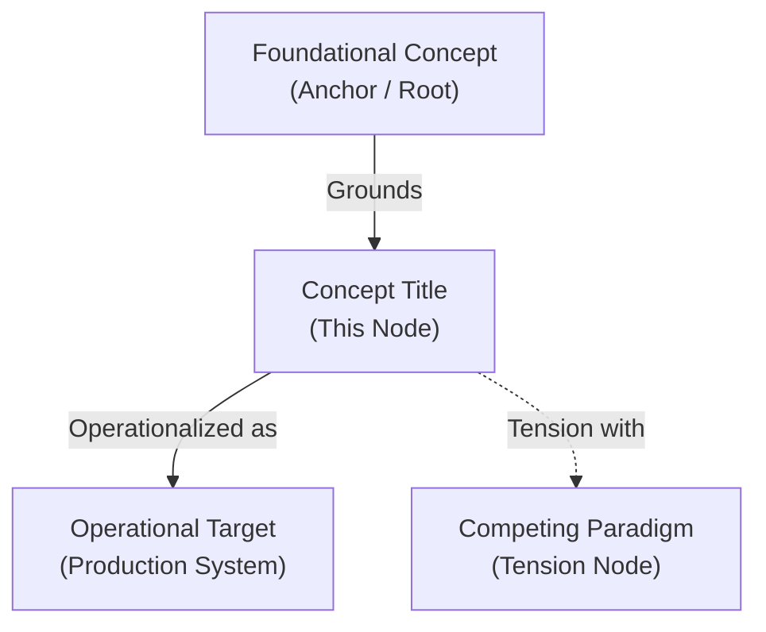

# Concept Title

---

## 1. Executive Summary & Conceptual Thesis

A concise, high-level summary of the conceptual thesis, theoretical construct, or customer/technical problem being addressed:
* **The Core Thesis**: Define what this concept represents and its normative or architectural aim.
* **The Problem or Gap**: Why traditional approaches are insufficient or what failure mode this resolves.
* **The Proposed Mechanism**: The technical, mathematical, or operational solution introduced.

---

## 2. Conceptual Mind Map & Relational Edges

A Mermaid diagram mapping this concept to neighboring concepts and architectural pillars:

---

## 3. Theoretical, Architectural & Institutional Grounding

Map the external provenance, canonical literature, and institutional backing of this concept:
* **Industry Standards & Specifications**: Citing relevant RFCs, API contracts, or protocols.
* **Academic & Research Provenance**: Foundational research papers, laboratory preprints, or formal proofs.
* **Institutional Alignment**: How this concept relates to organizational values and architecture principles.

---

## 4. Dialectical Tensions & Trade-Offs

Contrast this concept against competing paradigms or anti-patterns:
* **Traditional Approach vs. Proposed Concept**: Contrast trade-offs (e.g. centralized control vs. distributed resiliency).
* **Failure Modes & Sociotechnical Risks**: What happens if this concept is misapplied or left unconstrained.

---

## 5. Related Knowledge Base Documents
* [The DELTA Framework](/ecosystem/delta-framework.md) - Ethical alignment and human dignity principles.
* [Customer Discovery & Workflow Observations](/research/user-interview-example.md) - Qualitative research and HCD findings.
