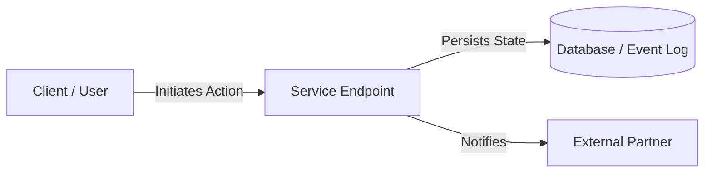

# Concept Title

## 1. Overview & Problem Statement
A concise, high-level summary of the customer or technical problem being addressed and the proposed solution.

---

## 2. Architectural Design & User Journey
Describe the system interactions, data contracts, and UX flows. Use structured diagrams or tables.

---

## 3. Data Contracts & Interfaces
Define the data structures, schemas, or API signatures associated with this proposal:

| Field Name | Type | Required | Description |
| :--- | :--- | :---: | :--- |
| `id` | `STRING` | Yes | Unique resource identifier. |
| `status` | `ENUM` | Yes | Lifecycle status (`pending`, `active`, `completed`). |
| `payload` | `OBJECT` | No | Optional contextual metadata. |

---

## 4. Rollout Strategy & Phasing
* **Phase 1 (Proof-of-Concept)**: Sandbox testing and early validation.
* **Phase 2 (Pilot)**: Limited deployment to key users.
* **Phase 3 (General Availability)**: Full production rollout.

---

## 5. Related Knowledge Base Documents
* [The DELTA Framework](/ecosystem/delta-framework.md) - Ethical alignment and human dignity principles.
* [Customer Discovery & Workflow Observations](/research/user-interview-example.md) - Qualitative research and HCD findings.
