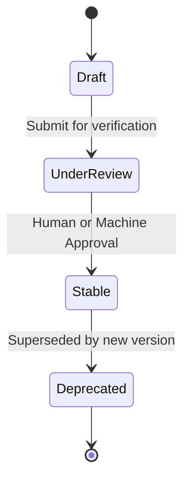

# Technical Reference Title

## 1. Specification Overview
Formal scope, canonical version, and governance authority for this specification.

---

## 2. Core Concepts & Data Structures

| Entity / Type | Data Type | Constraint | Description |
| :--- | :--- | :--- | :--- |
| `resource_id` | UUIDv4 | Unique | Global identifier |
| `timestamp` | ISO 8601 UTC | Required | Event generation time |

---

## 3. Protocol Rules & Lifecycle States
State machine rules and transition constraints:

---

## 4. Conformance & Verification Requirements
Criteria that any conforming implementation or agent must satisfy:
1. Conformance Rule 1
2. Conformance Rule 2
