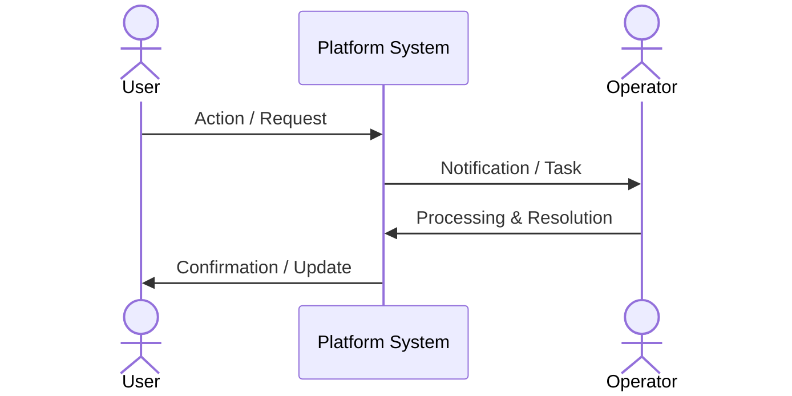

# Product Concept Display Title

```markdown

```

---

## 1. Executive Summary & Context
* **Target Audience / Users**: Primary user personas and operational roles involved.
* **Core Problem**: Key pain point being resolved (e.g. wait times, drop-off, manual data entry, disconnected systems).
* **Solution Summary**: Overview of the product capability and digital intervention.

---

## 2. Panel-by-Panel Detailed Script

### Panel 1: [Step 1 Title]
* **Setting & Actors**: Who is involved and where does the action take place?
* **Digital Touchpoint**: Device, screen, or integration involved.
* **Key Action**: What happens in this step?

### Panel 2: [Step 2 Title]
* **Setting & Actors**:
* **Digital Touchpoint**:
* **Key Action**:

[Repeat for each panel in the storyboard sequence...]

---

## 3. System Touchpoints & Data Flow

| Panel | Actor | Touchpoint | Data Exchanged | Operational Outcome |
| :--- | :--- | :--- | :--- | :--- |
| **1. [Title]** | [Role] | [Interface] | [Data] | [Outcome] |



---

## 4. Expected Operational & Business Impact
* **Efficiency**: Quantitative or qualitative time savings.
* **Accuracy**: Reduction in human errors, duplicate data entry, or drop-offs.
* **Experience**: User and stakeholder satisfaction impact.
