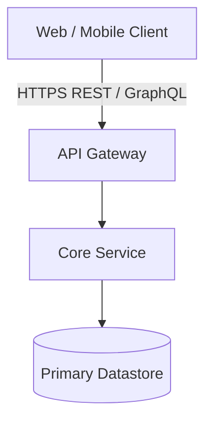

# Component Name

## 1. Overview & Business Function
Single-paragraph summary of what this component does, its ownership team, and its role in production operations.

---

## 2. Technical Stack & Deployment
* **Language & Framework**: e.g., Python / FastAPI, TypeScript / React, Go, etc.
* **Storage & Caching**: PostgreSQL, Redis, DynamoDB, etc.
* **Hosting & Runtime**: Kubernetes, AWS ECS, GCP Cloud Run, on-premise, etc.
* **Source Repository**: `https://github.com/<org>/<repo>`

---

## 3. Architecture & Data Flow
Component interaction diagram:

---

## 4. Key Endpoints & Data Contracts
Primary interfaces and contracts exposed by this component:

| Method | Endpoint | Description | Auth Required |
| :--- | :--- | :--- | :---: |
| `GET` | `/api/v1/health` | Service liveness and health probe | No |
| `POST` | `/api/v1/resources` | Create a new entity instance | Yes (Bearer JWT) |

---

## 5. Observability & Operational Runbooks
* **Dashboards**: Link to Datadog, Grafana, CloudWatch, or GCP Monitoring.
* **Alerting Policies**: P1/P2 paging conditions and escalation paths.
* **Operational Playbooks**: [Incident Runbook](/playbooks/onboarding-guide.md).
